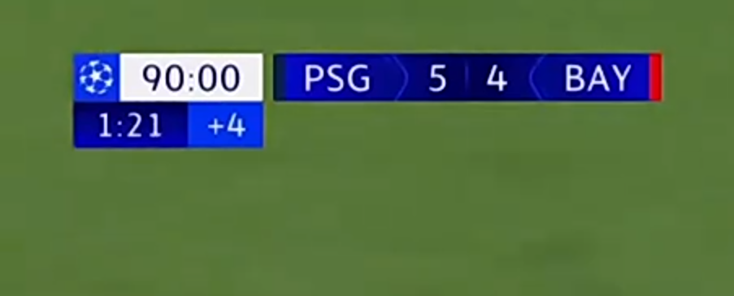

# BizTrack - Business Management System

A modern, full-featured business management system for small to medium businesses. Track sales, manage inventory, monitor expenses, and generate professional reports - all in one place.



## 🚀 Features

### Core Features
- **📊 Dashboard** - Real-time business metrics and analytics
- **🛡️ Admin Panel** - Platform-wide management and monitoring (separate from business dashboard)
- **📦 Orders Management** - Track orders from WhatsApp, Facebook, Instagram, TikTok, and more
- **💰 Sales Tracking** - Record sales with automatic inventory deduction
- **📦 Inventory Management** - Full CRUD operations with low stock alerts
- **💸 Expense Tracking** - Monitor business expenses by category
- **📈 Profit Analysis** - Track revenue, expenses, and net profit
- **🧾 Receipt Generation** - Digital receipts via WhatsApp, SMS, or Email
- **📑 Report Exports** - Download CSV and PDF reports
- **🔍 Search & Filter** - Find transactions quickly
- **💾 Data Persistence** - All data saved automatically (localStorage + SQLite)

### Multi-Platform Order Management
- **📱 WhatsApp Orders** - Direct messaging integration
- **📘 Facebook Orders** - Social media order tracking
- **📸 Instagram Orders** - Visual platform integration
- **🎵 TikTok Orders** - Trending platform support
- **☎️ Phone Orders** - Traditional call orders
- **📧 Email Orders** - Business email orders
- **🚶 Walk-in Orders** - In-store customer orders
- **📊 Order Statistics** - Track performance by platform

### Admin Features
- **👥 User Management** - View, search, suspend, activate, delete users
- **📊 Platform Analytics** - Monitor all businesses, revenue, orders
- **🔍 Search & Filter** - Find users by email or business name
- **📥 Data Export** - Export all user data for backup
- **📈 Performance Metrics** - Top performers, revenue distribution
- **🏥 System Health** - Monitor API, database, storage status

### User Experience
- **🌓 Dark/Light Mode** - Toggle between themes
- **🖼️ Custom Logo** - Upload your business logo
- **📱 PWA Support** - Install as a mobile/desktop app
- **📊 Daily Summaries** - Yesterday's performance on login
- **💾 Backup/Restore** - Export and import all data
- **🏪 Multi-Location** - Support for multiple business locations
- **🔐 Real Authentication** - Secure JWT-based authentication with bcrypt

### Smart Features
- **Auto-Calculate** - Totals calculated automatically
- **Unit Dropdown** - Easy unit selection (kg, liters, bags, etc.)
- **Low Stock Warnings** - Get notified when inventory is low
- **AI Assistant** - Get business insights and recommendations
- **Real-time Updates** - See changes instantly

## 🛠️ Tech Stack

### Frontend
- **React** - UI framework
- **Vite** - Build tool
- **Tailwind CSS** - Styling
- **React Router** - Navigation
- **React Icons** - Icon library
- **Recharts** - Charts and graphs
- **React Toastify** - Notifications

### Backend (Production)
- **Node.js** - Runtime environment
- **Express** - Web framework
- **SQLite** - Production database
- **JWT** - Token-based authentication
- **bcrypt** - Secure password hashing
- **dotenv** - Environment configuration

## 📦 Installation

### Prerequisites
- Node.js (v14 or higher)
- npm or yarn

### Setup

1. **Clone the repository**
   ```bash
   git clone <repository-url>
   cd tech world
   ```

2. **Install dependencies**
   ```bash
   # Install backend dependencies
   cd backend
   npm install

   # Install frontend dependencies
   cd ../frontend
   npm install
   ```

3. **Configure environment**
   ```bash
   # In backend directory
   cp .env.example .env
   # Edit .env with your settings
   ```

4. **Start the application**
   ```bash
   # Terminal 1 - Start production backend
   cd backend
   node server-production.js

   # Terminal 2 - Start frontend
   cd frontend
   npm run dev
   ```

5. **Access the application**
   - Frontend: http://localhost:3000
   - Backend API: http://localhost:5000
   - Health Check: http://localhost:5000/api/health

## 🎯 Quick Start

### First Time Setup

1. **Register an account**
   - Go to http://localhost:3000/register
   - Enter your business details
   - Create your account

2. **Add inventory items**
   - Navigate to Inventory page
   - Click "Add Item"
   - Enter item details (name, quantity, unit, price)

3. **Record your first sale**
   - Go to Dashboard
   - Click "Add Sale"
   - Select item, quantity, unit, and price
   - Click "Add Sale"
   - Inventory automatically updates!

4. **Generate a receipt**
   - After recording a sale
   - Click "Print Receipt"
   - Receipt opens in new window

5. **Export reports**
   - Go to Reports page
   - Choose report type (Sales, Inventory, Transactions)
   - Click "Download CSV" or "Download PDF"

## 📖 Usage Guide

### Recording a Sale

1. Click **"Add Sale"** on the dashboard
2. Fill in the form:
   - **Item Name**: Product being sold
   - **Quantity**: Amount sold
   - **Unit**: Select from dropdown (kg, liters, bags, etc.)
   - **Price/Unit**: Price per unit
   - **Total**: Auto-calculated
   - **Payment Status**: Select "Paid (Completed)" or "Not Paid (Pending)"
3. Click **"Add Sale"**
4. Inventory automatically decreases
5. If payment is completed, send receipt via:
   - **WhatsApp**: Opens WhatsApp with receipt text
   - **SMS**: Sends text message (requires API)
   - **Email**: Opens email client with receipt

### Managing Inventory

1. Go to **Inventory** page
2. View all items with stock levels
3. **Add Item**: Click "Add Item" button
4. **Edit Item**: Click edit icon on any item
5. **Delete Item**: Click delete icon
6. **Low Stock**: Items below minimum stock show warnings

### Tracking Expenses

1. Click **"Add Expense"** on dashboard
2. Enter description and amount
3. Select category (Supplies, Salaries, Utilities, etc.)
4. Click "Add Expense"
5. View in activity feed and reports

### Generating Reports

1. Go to **Reports** page
2. Select report type:
   - **Sales Report**: All sales transactions
   - **Inventory Report**: Current stock levels
   - **Transactions Report**: All financial transactions
3. Click **"Download CSV"** or **"Download PDF"**
4. File downloads to your computer

### Using Admin Panel

1. Click **"Admin Panel"** in sidebar (red, with ADMIN badge)
2. View **Platform Overview**:
   - Total businesses, active users
   - Platform revenue, total orders
   - New users today, active today
3. Manage **Users**:
   - Search by email or business name
   - Filter by status (Active/Suspended)
   - Suspend, activate, or delete users
   - Export user data
4. View **Analytics**:
   - Top revenue generators
   - Most active businesses
   - System health status
5. Click **"Back to My Dashboard"** to return to your business

### Customizing Settings

1. Go to **Settings** page
2. **Upload Logo**: Click "Upload Logo" and select image
3. **Toggle Theme**: Switch between dark/light mode
4. **Backup Data**: Click "Export Data" to download JSON
5. **Restore Data**: Click "Import Data" to restore from JSON

## 🎨 Features in Detail

### Unit Dropdown
When recording sales, select from 10 unit types:
- **kg** - Kilograms
- **liters** - Liters
- **bags** - Bags
- **pieces** - Individual pieces
- **boxes** - Boxes
- **crates** - Crates
- **units** - Generic units
- **grams** - Grams
- **ml** - Milliliters
- **dozen** - Dozen (12 items)

Units appear in:
- Sale descriptions
- Receipts and invoices
- Activity feed
- Reports

### Automatic Inventory Deduction
When you record a sale:
1. System checks if item exists in inventory
2. Automatically deducts the quantity sold
3. Shows updated stock level
4. Warns if stock is low

### Digital Receipt Delivery
Professional receipts can be sent via:
- **WhatsApp**: Direct message with receipt details
- **SMS**: Text message to customer phone
- **Email**: Email with receipt information

Receipts include:
- Business information
- Receipt number and date
- Customer phone
- Item details with units
- Payment method
- Total amount

**Note**: Receipts only available after payment is confirmed (status = "Paid")

### Data Persistence

**Frontend (localStorage)**:
- Sales transactions
- Inventory items
- Expenses
- Business settings
- Theme preference
- Custom logo

**Backend (SQLite Database)**:
- User accounts (encrypted passwords)
- Authentication tokens
- Business profiles
- Transaction history
- Order records

Data survives:
- Page refresh
- Browser close
- Computer restart
- Server restart

## 🔒 Security

- **Password Hashing**: bcrypt with salt rounds
- **JWT Authentication**: Secure token-based auth (30-day expiry)
- **Protected Routes**: Frontend and backend route protection
- **Input Validation**: Email, password, and data validation
- **SQL Injection Prevention**: Parameterized queries
- **CORS Configuration**: Controlled cross-origin requests
- **Error Handling**: Comprehensive error management
- **Environment Variables**: Sensitive data in .env files

## 📱 PWA Support

Install BizTrack as an app:
1. Build for production: `npm run build`
2. Serve the build
3. Browser will show "Install App" prompt
4. Click to install
5. Use like a native app!

## 🤝 Contributing

Contributions are welcome! Please:
1. Fork the repository
2. Create a feature branch
3. Make your changes
4. Test thoroughly
5. Submit a pull request

## 📄 License

This project is licensed under the MIT License.

## 🚀 Production Deployment

Ready to deploy to an external server?

### ⚡ Quick Start

```bash
# 1. Update environment variables
# Edit: frontend/.env.production
# Edit: admin-panel/.env.production

# 2. Build everything
bash deploy.sh

# 3. Upload to server
rsync -avz deployment/user-app/ user@server:/var/www/app/
rsync -avz deployment/admin-app/ user@server:/var/www/admin/
rsync -avz deployment/backend/ user@server:/var/www/api/

# 4. On server - Start backend
cd /var/www/api
npm install --production
pm2 start ecosystem.config.js
pm2 save
```

### 📚 Documentation
- **START_HERE.md** - Quick deployment guide
- **PRODUCTION_DEPLOYMENT_GUIDE.md** - Detailed instructions with Nginx, SSL, security

### 🌐 Production URLs
- User App: `https://app.yourdomain.com`
- Admin App: `https://admin.yourdomain.com`
- Backend API: `https://api.yourdomain.com`

---

## 🆘 Support

For issues or questions:
1. Check `START_HERE.md` for quick deployment
2. See `PRODUCTION_DEPLOYMENT_GUIDE.md` for detailed instructions
3. Review the code documentation
4. Open an issue on GitHub

## 🎉 Acknowledgments

Built with modern web technologies and best practices for small business management.

---

**Version**: 3.0.0  
**Last Updated**: May 1, 2026  
**Status**: Production Ready ✅

### ✅ Completed Features
- ✅ Real Authentication (JWT + bcrypt)
- ✅ SQLite Database (PostgreSQL ready)
- ✅ **Separate Admin Panel** (completely isolated from user app)
- ✅ **Role-Based Access Control** (user/admin roles)
- ✅ Multi-Platform Orders
- ✅ Digital Receipt Delivery
- ✅ PWA Support
- ✅ Dark/Light Mode
- ✅ Full CRUD Operations
- ✅ **Production Deployment Ready**
- ✅ **Comprehensive Documentation**

### 🏗️ Architecture
- **User Application** (Port 3000) - Business management for users
- **Admin Application** (Port 3001) - Platform administration
- **Backend API** (Port 5001) - Shared API with role-based access
- **Complete Data Separation** - No mixing between user and admin data

### 🚀 Ready to Deploy
All applications are built, tested, and ready for external server deployment.  
**Start with**: `START_HERE.md`

**Happy Business Management!** 💼🛡️
